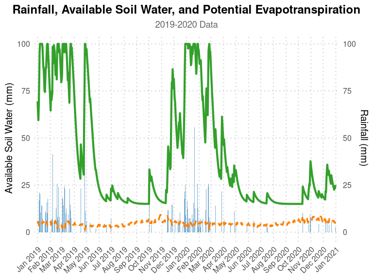

<!-- README.md is generated from README.Rmd. Please edit that file -->
<p id="start" align="center">
<a href="#start"></a>
</p>

<div align="center">

<a href="https://github.com/RobelTakele/AquaBEHER/issues/new?labels=bug&projects=&template=01_BUG-REPORT.yml&title=%5BBUG%5D+%3Ctitle%3E" style="font-size: 20px;">Report
a Bug</a>    \|   
<a href="https://github.com/RobelTakele/AquaBEHER/discussions/new?category=ideas" style="font-size: 20px;">Request
a Feature</a>    \|   
<a href="https://github.com/RobelTakele/AquaBEHER/discussions/new/choose" style="font-size: 20px;">Ask
a Question</a>

<!-- badges: start -->

<a href="https://github.com/RobelTakele/AquaBEHER">
</a>
<a href="https://github.com/RobelTakele/AquaBEHER/actions/workflows/R-CMD-check.yaml">

</a> <a href="https://lifecycle.r-lib.org/articles/stages.html#stable">

</a> <a href="https://www.gnu.org/licenses/gpl-3.0.en.html">

</a> <a href="https://www.gnu.org/licenses/gpl-3.0.en.html">

</a> <!-- badges: end -->

</div>

<p id="line" align="center">
<a href="#line"></a>
</p>

**Estimates** and **predicts** the wet season calendar (WSC) and soil
water balance for agricultural applications. It integrates daily
potential evapotranspiration (PET) and soil water balance parameters to
compute the WSC for crop and soil water management. Using these
parameters, `AquaBEHER` can estimate and predict the onset, cessation,
and duration of the wet season based on an agroclimatic approach.

### ⛓ Key Features

- **Daily potential evapotranspiration (PET)** estimation using various
  methods.
- **Daily soil water balance** estimation based on adjustable soil water
  holding capacity (soilWHC).
- **Wet season calendar** estimation and seasonal prediction including:
  - Onset of the wet season
  - Cessation of the wet season
  - Duration of the wet season

`AquaBEHER` is designed to facilitate water-efficient agricultural
practices in response to climate variability and change.

------------------------------------------------------------------------

## :arrow_down: Installation

### Install from CRAN:

``` r
install.packages("AquaBEHER")
```

### Install the development version from GitHub:

``` r
# install.packages("devtools")
devtools::install_github("RobelTakele/AquaBEHER")
```

To view the vignettes in RStudio, run:

``` r
vignette("AquaBEHER", "AquaBEHER")
```

Further details regarding `AquaBEHER` are available on the package
website, visit [here](https://robeltakele.github.io/AquaBEHER/).

------------------------------------------------------------------------

## :fast_forward: Quick Example

Here’s a quick example to estimate daily soil water balance:

``` r
library(AquaBEHER)
data(AgroClimateData)

# Estimate PET using Penman-Monteith method
PET <- calcEto(AgroClimateData, method = "PM", Zh = 10)

# Add PET to the dataset
AgroClimateData$Eto <- PET$ET.Daily

# Estimate daily soil water balance for a soil with 100mm water holding capacity
watBal.list <- calcWatBal(data = AgroClimateData, soilWHC = 100)
watBal <- watBal.list$data
head(watBal)
#>       GridID       Lat     Lon     Elev      WHC Year Month Day Rain     Tmax
#> 1 MOZ0007149 -15.09238 39.2519 392.1337 97.84914 1982     1   1    0 32.24396
#> 2 MOZ0007149 -15.09238 39.2519 392.1337 97.84914 1982     1   2    0 33.07202
#> 3 MOZ0007149 -15.09238 39.2519 392.1337 97.84914 1982     1   3    0 33.49679
#> 4 MOZ0007149 -15.09238 39.2519 392.1337 97.84914 1982     1   4    0 32.76818
#> 5 MOZ0007149 -15.09238 39.2519 392.1337 97.84914 1982     1   5    0 32.65872
#> 6 MOZ0007149 -15.09238 39.2519 392.1337 97.84914 1982     1   6    0 31.80630
#>       Tmin       Rs     Tdew       Uz      Eto R AVAIL TRAN DRAIN RUNOFF
#> 1 23.11500 23.86698 20.21160 4.723783 6.447727 0     0    0     0      0
#> 2 23.12585 26.38375 20.48284 4.279407 6.802067 0     0    0     0      0
#> 3 23.12602 25.00704 20.45689 3.622179 6.485418 0     0    0     0      0
#> 4 23.60351 24.16475 20.83896 2.535047 5.838723 0     0    0     0      0
#> 5 22.79294 23.44483 21.36882 1.477617 5.231518 0     0    0     0      0
#> 6 22.43975 21.99277 21.29297 1.953415 5.026133 0     0    0     0      0
```

------------------------------------------------------------------------

## :bar_chart: Visualization

Visualize the daily soil water balance, rainfall, and potential
evapotranspiration (Eto) for the climatological year 2019–2020:

``` r
library(ggplot2)

# Filter the data for 2019 and 2020
watBal.19T20 <- watBal[watBal$Year %in% c(2019, 2020), ]
date.vec <- as.Date(paste(watBal.19T20$Year, watBal.19T20$Month, watBal.19T20$Day, sep = "-"), format = "%Y-%m-%d")
watBal.19T20$date <- date.vec

# Plot water balance with ggplot2
ggplot(watBal.19T20, aes(x = date)) +
  geom_bar(aes(y = Rain), stat = "identity", fill = "#1f78b4", alpha = 0.6, width = 0.8) +
  geom_line(aes(y = AVAIL), color = "#33a02c", size = 1.5) +
  geom_line(aes(y = Eto), color = "#ff7f00", size = 1.2, linetype = "dashed") +
  scale_x_date(date_labels = "%b %Y", date_breaks = "1 month", expand = c(0.01, 0)) +
  scale_y_continuous(
    name = "Available Soil Water (mm)",
    sec.axis = sec_axis(~., name = "Rainfall (mm)")
  ) +
  labs(
    title = "Rainfall, Available Soil Water, and Potential Evapotranspiration",
    subtitle = "2019-2020 Data",
    x = NULL, y = NULL
  ) +
  theme_minimal(base_size = 15) +
  theme(
    plot.title = element_text(face = "bold", size = 18, hjust = 0.5),
    plot.subtitle = element_text(size = 14, hjust = 0.5, color = "grey40"),
    axis.text.x = element_text(angle = 45, hjust = 1),
    panel.grid.minor = element_blank(),
    panel.grid.major = element_line(linetype = "dotted", color = "grey80")
  )
```



## :memo: Citation

If you used `AquaBEHER` in your work, please cite it. You can view the
most recent citation by running:

``` r
citation(package = "AquaBEHER")
```

    To cite `AquaBEHER` in publications, please use:

      Robel Takele, Matteo Dell'Acqua (2023). `AquaBEHER`: Estimation and Prediction of Wet Season Calendar and Soil
      Water Balance for Agriculture. R package version 1.0.0. Available at
      https://cran.r-project.org/web/packages/AquaBEHER

    A BibTeX entry for LaTeX users is:

      @Manual{,
        title = {`AquaBEHER`: Estimation and Prediction of Wet Season Calendar and Soil Water Balance for Agriculture},
        author = {Robel Takele and Matteo Dell'Acqua},
        year = {2023},
        note = {R package version 1.0.0},
        url = {https://robeltakele.github.io/AquaBEHER/},
      }

## :earth_africa: Feedback and Contributions 🤝

We appreciate feedback and contributions to improve `AquaBEHER`. Feel
free to report bugs, suggest features, or join discussions.

Your contributions make a difference!

> \[!IMPORTANT\] Submit issues
> [here](https://github.com/RobelTakele/AquaBEHER/issues/) or join
> discussions
> [here](https://github.com/RobelTakele/AquaBEHER/discussions).

✤ <i>We appreciate your support and look forward to making our package
even better with your help!</i>

------------------------------------------------------------------------

## :mailbox_with_mail: Contact Us


The **Genetics Group** at the *Institute of Plant Sciences* is a
culturally diverse, research-driven team focused on advancing
agricultural innovation. We combine crop genetics, climate science, and
participatory strategies to develop sustainable farming solutions.

We are based at **Scuola Superiore Sant’Anna**, Pisa, Italy.

For inquiries, please reach out to: - [Matteo
Dell’Acqua](mailto:m.dellacqua@santannapisa.it) - [Mario Enrico
Pè](mailto:m.pe@santannapisa.it)

Learn more about our work on the [institute web
page](https://www.santannapisa.it/en/institute/plant-sciences).

<div align="center">

<a href="https://twitter.com/intent/tweet?text=Check%20out%20this%20project%20on%20GitHub:%20https://github.com/RobelTakele/AquaBEHER">

</a>
<a href="https://www.linkedin.com/sharing/share-offsite/?url=https://github.com/RobelTakele/AquaBEHER">

</a>
<a href="https://www.facebook.com/sharer/sharer.php?u=https://github.com/RobelTakele/AquaBEHER">

</a>
<a href="https://www.reddit.com/submit?title=Check%20out%20this%20project%20on%20GitHub:%20https://github.com/RobelTakele/AquaBEHER">

</a>

</div>

## :link: Resources

- [`AquaBEHER`
  Documentation](https://CRAN.R-project.org/package=AquaBEHER)
- [`AquaBEHER` GitHub
  Repository](https://github.com/RobelTakele/AquaBEHER)
- [Scuola Superiore
  Sant’Anna](https://www.santannapisa.it/en/institute/plant-sciences)

------------------------------------------------------------------------

## 🌟 Show Your Support

If you find **`AquaBEHER`** helpful or interesting, please consider
giving us a star on GitHub. Your support helps promote the project and
lets others know it’s worth checking out.

🙏 Thank you for your support! 👍

[](https://github.com/RobelTakele/AquaBEHER/stargazers)

------------------------------------------------------------------------

## 👥 Contributors

<div>

<p>
👨‍💻 <b>Robel Takele</b><br>       Email:
<a href="mailto:takelerobel@gmail.com">takelerobel@gmail.com</a><br>
      GitHub: <a href="https://github.com/RobelTakele">@RobelTakele</a>
</p>
<p>
👨‍💻 <b>Matteo Dell’Acqua</b><br>       Email:
<a href="mailto:m.dellacqua@santannapisa.it">m.dellacqua@santannapisa.it</a><br>
      GitHub: <a href="https://github.com/mdellh2o">@MatteoDellAcqua</a>
</p>

</div>

### 🄯 License

This project is licensed under the GNU General Public License,
[GPL-3](https://cran.r-project.org/web/licenses/GPL-3).

<p align="right">
<a href="#start"><button style="padding:10px 30px; background-color:#0096FF; color:white; border:none; border-radius:5px; cursor:pointer;">Back
to Top</button></a>
</p>

------------------------------------------------------------------------
