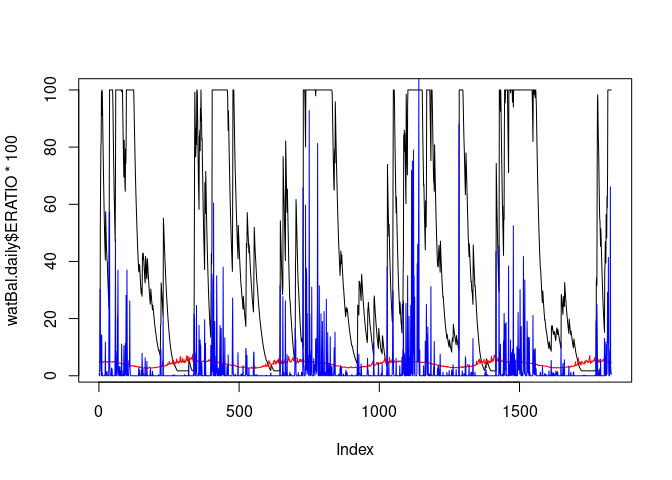

<!-- README.md is generated from README.Rmd. Please edit that file -->

# AquaBEHER

<!-- badges: start -->

[](https://github.com/RobelTakele/AquaBEHER/actions/workflows/R-CMD-check.yaml)
[](https://www.repostatus.org/#active)
[](https://lifecycle.r-lib.org/articles/stages.html#stable)
[](https://www.gnu.org/licenses/gpl-3.0.en.html)
[](https://cran.r-project.org/package=AquaBEHER)
<!-- badges: end -->

The goal of AquaBEHER is to computes and integrates daily reference
evapotranspiration (Eto) into FAO56 water balance model. The AquaBEHER
package can estimate daily parameters of crop and soil water balances
parameters for agricultural crops. The package can also estimate rainy
season calandar (Onset, Cessation and Duration) based on agroclimatic
approach.

Specifically, the package can perform the following functions:

- Estimation of daily evapotranspiration
- Estimation of daily soil water balance
- Estimation of rainy season calandar:
  - Onset of the rainy season
  - Cessation of the rainy season
  - Duration of the rainy season

## Installation

You can install the development version of AquaBEHER from
[GitHub](https://github.com/) with:

``` r
# install.packages("devtools")
devtools::install_github("RobelTakele/AquaBEHER")
```

## Example

This is a basic example which shows you how to estimate daily water
balance:

``` r
library(AquaBEHER)
library(ggplot2)
## basic example code
```

What is special about using `README.Rmd` instead of just `README.md`?
You can include R chunks like so:

``` r
data(AgroClimateData)

head(AgroClimateData)
#>       GridID       Lat     Lon     Elev      WHC Year Month Day     Rain
#> 1 MOZ0007149 -15.09238 39.2519 392.1337 97.84914 1982     1   1 0.000000
#> 2 MOZ0007149 -15.09238 39.2519 392.1337 97.84914 1982     1   2 0.000000
#> 3 MOZ0007149 -15.09238 39.2519 392.1337 97.84914 1982     1   3 0.000000
#> 4 MOZ0007149 -15.09238 39.2519 392.1337 97.84914 1982     1   4 1.907393
#> 5 MOZ0007149 -15.09238 39.2519 392.1337 97.84914 1982     1   5 0.000000
#> 6 MOZ0007149 -15.09238 39.2519 392.1337 97.84914 1982     1   6 0.000000
#>       Tmax     Tmin       Rs     Tdew       Uz
#> 1 32.24396 23.11500 23.86698 20.21160 4.723783
#> 2 33.07202 23.12585 26.38375 20.48284 4.279407
#> 3 33.49679 23.12602 25.00704 20.45689 3.622179
#> 4 32.76818 23.60351 24.16475 20.83896 2.535047
#> 5 32.65872 22.79294 23.44483 21.36882 1.477617
#> 6 31.80630 22.43975 21.99277 21.29297 1.953415
```

``` r
Eto.daily <- calcEto(AgroClimateData, method = "PM", Zh = 10)
#> Adjusted 0 instances where Tmin was equal to or greater than Tmax.
#> Penman-Monteith FAO56 Reference Crop ET
#> Evaporative surface: FAO-56 hypothetical short grass, albedo = 0.23 ; surface resistance = 70 sm^-1; crop height = 0.12 m; roughness height = 0.02 m
#> Timestep: daily
#> Units: mm
#> Time duration: 1982-01-01 to 2022-12-31
AgroClimateData$Eto <- Eto.daily$ET.Daily
soilWHC <- 100
watBal <- calcWatBal(AgroClimateData, soilWHC)
```

The output of daily soil water balance can be ploted:

``` r
watBal <- watBal[watBal$Year %in% c(2010, 2020), ]
date.vec <- as.Date.character(paste0(watBal$Year, "-", watBal$Month, "-", watBal$Day))

plot(watBal$AVAIL, ty = "l", xlab = "Days since 2010", ylab = "Water (mm)", col = "black", lwd = 1, lty = 2)
lines(watBal$Eto, col = "red", lwd = 3)
lines(watBal$Rain, col = "blue", lwd = 1)

legend("bottom", c("Rain", "Eto", "Available Moisture"),
  horiz = TRUE, bty = "n", cex = 1, lty = c(1, 1, 2), lwd = c(2, 2, 2), inset = c(1, 1),
  xpd = TRUE, col = c("blue", "red", "black")
)
```




The Genetics Group at the **Center of Plant Sciences** is a
geographically and culturally diverse research team working on
data-drivem agicultural innovation combining crop genetics, climate, and
participatory approaches. We are based at **Scuola Superiore
Sant’Anna**, Pisa, Italy.

You can contact us sending an email to Matteo Dell’Acqua
(<a href="mailto:m.dellacqua@santannapisa.it"
class="uri">mailto:m.dellacqua@santannapisa.it</a>) or Mario Enrico Pè
(<a href="mailto:m.pe@santannapisa.it"
class="uri">mailto:m.pe@santannapisa.it</a>). You can find out more
about us visiting the group web page
(<http://www.capitalisegenetics.santannapisa.it/>)
