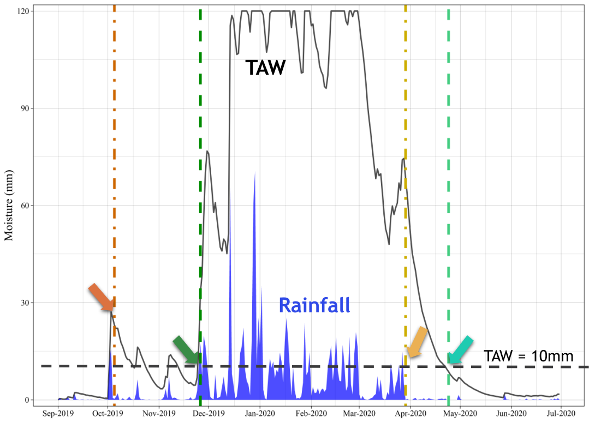

```{r, include = FALSE}
knitr::opts_chunk$set(
  collapse = TRUE,
  comment = "#>"
)
```

# 1. Introduction 

This vignette is a short tutorial to the usage and functionalists of AquaBEHER R package. It is directed to first-time package users who are familiar with the basic concepts of R. The vignette presents the use of several key functions of the package, some useful hints and guidelines. AquaBEHER computes and integrates daily reference evapotranspiration (Eto) and a soil water balance model to estimate parameters of crop and soil water balances for agricultural crops. Using the computed daily soil water balance parameters, the package can estimates the rainy season calendar (Onset, Cessation and Duration) based on agroclimatic approach for a predefined window. 


# 2. Installation and Loading

 Installing the latest development version from the online repository using the devtools package. Note that to utilize the full functionality of devtools on Windows, [Rtools](https://cran.r-project.org/bin/windows/Rtools/) must be installed.

```{r AquaBEHER setup}

# install.packages("devtools")
# devtools::install_github("RobelTakele/AquaBEHER", dependencies = TRUE, type = "source",
#                           build_manual = TRUE, build_vignettes = TRUE)

library(AquaBEHER)
library(ggplot2)

```

# 3. Required Climate Data

The methods for calculating evapotranspiration from meteorological data require various physical parameters. Some of the data are measured directly in weather stations. Other parameters are related to commonly measured data and can be derived with the help of a direct or empirical relationship.

The meteorological factors determining evapotranspiration are weather parameters which provide energy for vaporization and remove water vapor from the evaporating surface. The principal weather parameters to consider are presented below.

 * Maximum temperature
 * Minimum temperature
 * Solar radiation
 * Dew point temperature or relative humidity
 * Wind speed
 
In addition, georeferenced information on the location of the climate record is required:

 * Latitude 
 * Longitude
 * Elevation

```{r climateData}

 data(AgroClimateData)
 str(AgroClimateData)
 head(AgroClimateData)
 
```

# 4. Potential Evapotranspiration

For many agricultural applications, it is relevant to get an estimate of the potential evapotranspiration (PET). Different methods are developed for estimating Eto. Most of them use empirical equations to determine the value of PET from weather variables. The AquaBEHER package provides options for estimating reference evapotranspiration (Eto) using the FAO Penman-Monteith, Priestley Taylor and Hargreaves-Samani formulations.


### Usage
calcEto(AgroClimateData, method = "PM", crop = "short")

 * The function give a list of 
    + daily estimations of Eto in (mm/day)
    + daily estimations of extraterrestrial radiation (MJ/m2/day)
    + daily estimations of slope of vapor pressure curve (kPa/°C)

### Example
The calcEto compute with inputs of data frame containing daily values of meteorological parameters:

```{r}

PET <- calcEto(AgroClimateData, method = "PM", crop = "short")

str(PET)

```

Graphical comparison of the evapotranspiration (mm/day) calculated using the FAO Penman–Monteith formulation and the Hargreaves-Samani formulation:

```{r}
# Compute Eto using hargreves-samani formulation using the example data from 'AgroClimateData':

data(AgroClimateData)

Eto.HS <- calcEto(AgroClimateData, method = "HS")

# Now compute Eto using Penman-Monteith formulation for hypothetical grass (short crop):

Eto.PM <- calcEto(AgroClimateData, method = "PM", crop = "short")

plot(Eto.PM$ET.Daily[1:1000], ty="l", xlab="Days since 1996", ylab="Eto (mm/day)", col="black", lwd = 1, lty = 2)
lines(Eto.HS$ET.Daily[1:1000], col="blue", lwd = 2, lty = 1)

   legend("bottom",c("Eto: Penman–Monteith ","Eto: Hargreaves-Samani"),
         horiz=TRUE, bty='n', cex=1,lty=c(2,1),lwd=c(2,2), inset=c(1,1),
         xpd=TRUE, col=c("black","blue"))

```


**Notice:** It appears that the FAO Penman–Monteith formulation presents enhanced day-to-day variations of evapotranspiration than the the Hargreaves-Samani formulation.


# 5. Soil Water Balance

This function perform daily computations of soil water balance parameters for the root zone. Soil water changes daily in response to rainfall, evapotranspiration, runoff and deep drainage. 

**Assumptions**

 * Atmospheric conditions affect the rate at which crops use water.
 * The soil has uniform cross-section of homogeneous volume with a measured depth and a unit area.
 * A well-established, dense grass crop is growing, which completely covers the soil surface.

### Usage
calcWatBal(data, soilWHC)

### Example
The calcWatBal compute with inputs of data frame containing daily values of Rain, Eto and soil water holding capacity.

```{r}

# Add the estimated PET 'ET.Daily' to a new column in AgroClimateData:
 AgroClimateData$Eto <- PET$ET.Daily

# Estimate daily water balance for the soil having 100mm of WHC:
soilWHC = 100
 
watBal<- calcWatBal(AgroClimateData, soilWHC)

str(watBal )

# Plotting the water balance output for the climatological year from 2019 to 2020 using ggplot2:

 watBal.19T20 <- watBal[watBal$Year %in% c(2019, 2020),]
 date.vec <- as.Date.character(paste0(watBal.19T20$Year, "-", watBal.19T20$Month, "-", watBal.19T20$Day))

 ggplot(data = watBal.19T20) +
         geom_line(aes(y = AVAIL, x = date.vec, fill = "AVAIL"), size = 0.8, color = "red") +
         geom_col(aes(y = Rain, x = date.vec, fill = "Rain"), size = 1) +
        
         

         scale_x_date(date_breaks = "1 month", date_labels =  "%b-%Y") +
   
         scale_fill_manual(name = " ", values = c('AVAIL' = "red", 'Rain' = "blue")) +
   
         scale_y_continuous(expand = c(0, 2))  +
         labs(y="Moisture (mm)", x=NULL) +
   
         theme_linedraw()  +
   
   theme(axis.title = element_text(size = 14, colour = "black", family = "Times New Roman"),
         axis.text = element_text(size = 10, colour = "black", family = "Times New Roman"),
         axis.text.x = element_text(size = 10, colour = "black", family = "Times New Roman", angle = 45, vjust = 0.5))

```


# 6. Rainy Season Calandar

The onset and cessation dates of the rainy season were determined for each climatological year `Figure 1`. The term climatological year represents the period between two driest periods, which is traditionally defined based on a calender year starting from the driest month and has a fixed length of 12 months.


Various methods have been developed to estimate the rainy season calendar, i.e. the onset, cessation and duration of the rainy season. Common method used for crop production applications is the agroclimatic approach. As per agroclimatic approach, a normal rainy season (growing season) is defined as one when there is an excess of precipitation over potential evapotranspiration (PET). Such a period meets the evapotransiration demands of crops and recharge the moisture of the soil profile FAO 1977; 1978; 1986). Thus, the rainy season calendar defined accordingly:

 **Onset**

The onset of the rainy season will start on the first day after `onsetWind.start`, when the actual-to-potential evapotranspiration ratio is greater than 0.5 for 7 consecutive days, followed by a 20-day period in which plant available water remains above wilting over the root zone of the soil layer.

**Cesation**

The rainy season will end, cessation, on the first day after `onsetWind.end`, when the actual-to-potential evapotranspiration ratio is less than 0.5 for 7 consecutive days, followed by 12 consecutive non-growing days in which plant available water remains below wilting over the root zone of the soil layer.

**Duration**

The duration of the rainy season is the total number of days from onset to cessation of the season.




### Example

Using the example climate data provided by the AquaBEHER package, compute the rainy season calandar:

```{r}
# seasonal calndar is estimated for the onset window ranges from 01-September to 31-January having a soil with 100mm of WHC
soilWHC = 100
onsetWind.start = "1996-09-01"  # earliest possible start date of the onset window
onsetWind.end = "1997-01-31"    # the latest possible date for end of the onset window
cessaWind.end = "1997-06-30"    # the latest possible date for end of the cessation window

seasCal.lst <- calcSeasCal(watBal, onsetWind.start, onsetWind.end, cessaWind.end, soilWHC = 100)

str(seasCal.lst)

# plotting year to year variation of onset cessation and seasonal duration

seasCal.dF <- data.frame(Year = seasCal.lst[[1]][,c("Year")],
                         Onset = seasCal.lst[[1]][,c("JD")],
                         Cessation = seasCal.lst[[2]][,c("JD")],
                         Duration = seasCal.lst[[3]][,c("Duration")])

 ggplot(data = seasCal.dF) +
   geom_line(aes(y = Onset, x = Year, color = "Onset"), size = 1) +
   geom_line(aes(y = Cessation, x = Year, color = "Cessation"), size = 1) +
   geom_area(aes(y = Duration, x = Year, color = "Duration⁠"), size = 0.8, alpha = 0.4)+
 
   scale_color_manual(name = "Calendar", values = c('Onset' = "blue", 'Cessation' = "red", 'Duration' = "grey"))  +

 labs(y="Day of a year (DOY)", x=NULL) +

   theme_bw()


```


# 7. References

Allen, R.G.; Pereira, L.S.; Raes, D.; Smith, M. Crop Evapotranspiration: Guidelines for Computing Crop Water Requirements; FAO Irrigation and Drainage Paper no. 56; FAO: Rome, Italy, 1998; ISBN 92-5-104219-5.

Doorenbos, J. and Pruitt, W.O. 1975. Guidelines for predicting crop water requirements, Irrigation and Drainage Paper 24, Food and Agriculture Organization of the United Nations, Rome, 179 p.

Hargreaves, G.H. and Samani, Z.A. (1985) Reference Crop Evapotranspiration from Temperature. Applied Engineering in Agriculture, 1, 96-99.
http://dx.doi.org/10.13031/2013.26773 


$$\\[0.2in]$$


[](profile/projects.md#International) 

The **Center of Plant Sciences Group** is a geographically and culturally diverse research team working on climate and crop genetics 
at **Scuola Superiore Sant’Anna**, Pisa, Italy. 

You can contact us sending an email to Matteo Dell'Acqua (mailto:m.dellacqua@santannapisa.it) or Mario Enrico Pè (mailto:m.pe@santannapisa.it).
You can also visit the crop genetics (http://www.capitalisegenetics.santannapisa.it/) web page.

We are committed to the 
[free software](https://www.fsf.org/about/what-is-free-software) and 
[FAIR](https://www.go-fair.org/fair-principles/) principles.
This set of repositories collects our latest developments and provide reusable code.
