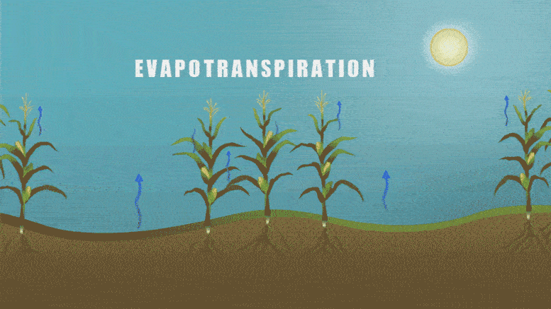
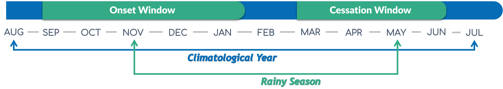
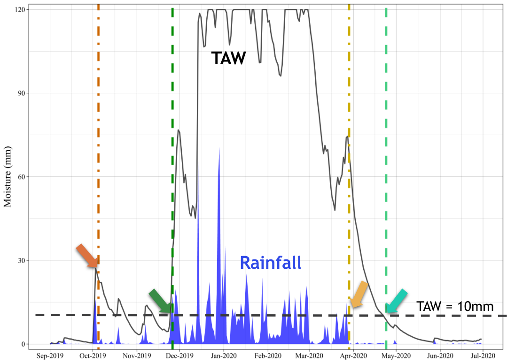

---
title: "Estimation and Prediction of the Wet Season Calendar (WSC) Using a Daily Soil Water Balance Model for Agricultural Applications Using AquaBEHER"
author: "Robel Takele and Matteo Dell'Acqua"
date: "`r Sys.Date()`"

output:
   prettydoc::html_pretty:
    theme: architect
    highlight: github
    math: mathjax
    fig_caption: yes
    toc: yes
    toc_depth: 2
    anchor_sections: yes
    number_sections: no
    df_print: default
    keep_tex: yes
    css: assets/AqB_vignette.css
    <!-- includes: -->
    <!--   after_body: assets/AqB_footer.html -->
      
vignette: >
  %\VignetteIndexEntry{AquaBEHER} 
  %\VignetteEngine{knitr::rmarkdown} 
  %\VignetteDepends{prettydoc}
  %\VignetteDepends{ggplot2}
  %\VignetteDepends{ggrepel} 
  %\VignetteDepends{scales} 
  %\VignetteEncoding{UTF-8}
  
---

```{r setup, include=FALSE}
knitr::opts_chunk$set(
  collapse = TRUE,
  comment = "#>",
  echo = TRUE,
  message = FALSE,
  warning = FALSE
)
```


<p id="start" align="center">
</p>

# 1. Introduction

Welcome to the tutorial for **AquaBEHER**, an R package designed to estimate 
and predict the wet season calendar and soil water balance for agricultural 
applications. This vignette provides a practical guide to using AquaBEHER. The 
package integrates daily potential evapotranspiration (PET) and soil water 
balance parameters to compute the wet season calendar (WSC) for crop and soil 
water management. Using these parameters, AquaBEHER can estimate and predict 
the onset, cessation, and duration of the wet season based on an 
agroclimatic approach.

In this tutorial, you will learn how to:

 * Install and set up AquaBEHER.
 * Estimate potential evapotranspiration (PET) using different methods.
 * Calculate daily soil water balance.
 * Estimate the wet season calendar using an agroclimatic approach.

# 2. Installation and Loading

To install the latest development version of AquaBEHER, use devtools. Ensure 
that Rtools is installed on Windows for full functionality.

```{r AquaBEHER setup}
## Install required packages:
# if (!require("pacman")) install.packages("pacman")
# pacman::p_load(knitr, rmarkdown, prettydoc, dplyr, ggplot2, lubridate,
# terra, devtools, ggrepel, zoo)

## Install AquaBEHER from CRAN:
# install.packages("AquaBEHER")

## Install AquaBEHER from GitHub:
# devtools::install_github("RobelTakele/AquaBEHER")

library(AquaBEHER)
library(ggplot2)
library(ggrepel)
library(dplyr)
```

# 3. Required Climate Data

For evapotranspiration calculations, various meteorological and geographical 
parameters are needed, as shown below:

Meteorological Data:

 * Maximum and minimum temperature
 * Solar radiation
 * Dew point temperature 
 * Wind speed
 * Rainfall 
 
Geographical Data:

 * Latitude
 * Longitude
 * Elevation

```{r climateData}
data(AgroClimateData)
str(AgroClimateData)
head(AgroClimateData)
```

# 4. Potential Evapotranspiration

Potential evapotranspiration (PET) is vital for agricultural water management. 
AquaBEHER offers multiple methods to estimate PET, including the 
FAO Penman-Monteith, Priestley-Taylor, and Hargreaves-Samani formulations.



### Usage:

 PET <- calcEto(AgroClimateData, method = "PM", crop = "short")  
 str(PET)  

 * The function return a list of
    + daily estimations of PET in (mm/day)
    + daily estimations of extraterrestrial radiation (MJ/m2/day)
    + daily estimations of slope of vapor pressure curve (kPa/°C)

### Example:

The calcEto function computes PET with inputs of a data frame containing daily 
values of meteorological parameters:

```{r }
PET <- calcEto(AgroClimateData, method = "PM", crop = "short")

str(PET)
```

Graphical comparison of the evapotranspiration (mm/day) calculated using 
the FAO Penman–Monteith formulation and the Hargreaves-Samani formulation:

```{r PETplot, fig.height = 4, fig.width = 6, fig.dpi = 300, fig.align = 'center'}
## Compute PET using Hargreaves-Samani formulation using the sample data f
## rom 'AgroClimateData':
Eto.HS <- calcEto(AgroClimateData, method = "HS")

## Now compute PET using Penman-Monteith formulation:
Eto.PM <- calcEto(AgroClimateData, method = "PM", Zh = 10)

plot(Eto.PM$ET.Daily[1:1000],
  type = "l", xlab = "Days since 1996",
  ylab = "Eto (mm/day)", col = "black", lwd = 1, lty = 2
)
lines(Eto.HS$ET.Daily[1:1000], col = "blue", lwd = 2, lty = 1)

legend("bottom", c("Eto: Penman–Monteith", "Eto: Hargreaves-Samani"),
  horiz = TRUE, bty = "n", cex = 1, lty = c(2, 1),
  lwd = c(2, 2), inset = c(1, 1),
  xpd = TRUE, col = c("black", "blue")
)
```

**Key Insight:** The FAO Penman–Monteith formulation presents enhanced 
day-to-day variations of evapotranspiration compared to the Hargreaves-Samani 
formulation.

# 5. Soil Water Balance

This function performs daily computations of soil water balance parameters for 
the root zone. Soil water changes daily in response to rainfall, 
evapotranspiration, runoff and deep drainage.

**Assumptions**

 * Atmospheric conditions affect the rate at which crops use water.
 * The soil has uniform cross-section of homogeneous volume with a measured 
 depth and a unit area.
 * A well-established, dense grass crop is growing, which completely covers 
 the soil surface.

### Usage:
calcWatBal(data, soilWHC)

### Example:
The calcWatBal compute with inputs of data frame containing daily values of 
Rain, Eto and soil water holding capacity.

```{r WATBALplot, fig.height = 6, fig.width = 10, fig.dpi = 300, fig.align = 'center'}
PET <- calcEto(AgroClimateData, method = "PM", Zh = 10)

## Add the estimated PET 'ET.Daily' to a new column in AgroClimateData:
AgroClimateData$Eto <- PET$ET.Daily

## Estimate daily water balance for the soil having 100mm of soilWHC:
soilWHC <- 100

watBal.list <- calcWatBal(data = AgroClimateData, soilWHC)
watBal <- watBal.list$data

str(watBal)

## Filter the data for the years 2019 and 2020:
watBal.19T20 <- watBal[watBal$Year %in% c(2019, 2020), ]

## Create a date vector:
date.vec <- as.Date(paste0(
  watBal.19T20$Year, "-",
  watBal.19T20$Month, "-",
  watBal.19T20$Day
), format = "%Y-%m-%d")

## Add the date vector to the data frame:
watBal.19T20$date <- date.vec

## Plotting the water balance output for the climatological year
## from 2019 to 2020 using ggplot2:

library(ggplot2)
library(scales)

ggplot(data = watBal.19T20, aes(x = date)) +
  geom_bar(aes(y = Rain),
    stat = "identity", fill = "#1f78b4",
    alpha = 0.6, width = 0.8
  ) +
  geom_line(aes(y = AVAIL), color = "#33a02c", size = 1.5) +
  geom_line(aes(y = Eto),
    color = "#ff7f00", size = 1.2,
    linetype = "dashed"
  ) +
  scale_x_date(
    date_labels = "%b %Y", date_breaks = "1 month",
    expand = c(0.01, 0)
  ) +
  scale_y_continuous(
    name = "Available Soil Water (mm)",
    sec.axis = sec_axis(~., name = "Rainfall (mm)")
  ) +
  labs(
    title = "Rainfall, Available Soil Water and
       Potential Evapotranspiration",
    subtitle = "Data from 2019 to 2020",
    x = " ",
    y = " "
  ) +
  theme_minimal(base_size = 15) +
  theme(
    plot.title = element_text(face = "bold", size = 18, hjust = 0.5),
    plot.subtitle = element_text(size = 14, hjust = 0.5, color = "grey40"),
    axis.title.y = element_text(color = "#33a02c"),
    axis.title.y.right = element_text(color = "#1f78b4"),
    axis.text.x = element_text(angle = 45, hjust = 1),
    panel.grid.minor = element_blank(),
    panel.grid.major = element_line(linetype = "dotted", color = "grey80")
  )
```


# 6. Rainy Season Calendar

The onset and cessation dates of the wet season were determined for each 
climatological year `Figure 1`. The term climatological year represents the 
period between two driest periods, which is traditionally defined based on a 
calendar year starting from the driest month and has a fixed length of 12 months.




Various methods have been developed to estimate the wet season calendar, 
i.e. the onset, cessation and duration of the wet season. Common method used 
for crop production applications is the agroclimatic approach. As per 
agroclimatic approach, a normal wet season (growing season) is defined as one 
when there is an excess of precipitation over potential evapotranspiration (PET). 
Such a period meets the evapotranspiration demands of crops and recharge the 
moisture of the soil profile (FAO 1977; 1978; 1986). Thus, the wet season 
calendar defined accordingly:

  **Onset**

  The onset of the wet season will start on the first day after 
  `onsetWind.start`, when the actual-to-potential evapotranspiration ratio is 
  greater than 0.5 for 7 consecutive days, followed by a 20-day period in which 
  plant available water remains above wilting over the root zone of the soil layer.

**Cessation**

  The wet season will end, cessation, on the first day after `onsetWind.end`, 
  when the actual-to-potential evapotranspiration ratio is less than 0.5 for 7 
  consecutive days, followed by 12 consecutive non-growing days in which plant 
  available water remains below wilting over the root zone of the soil layer.

**Duration**

  The duration of the wet season is the total number of days from onset to 
  cessation of the season.



### Usage:

calcSeasCal(data, onsetWind.start, onsetWind.end, cessaWind.end, soilWHC)

### Example:

Using the sample climate data provided by the AquaBEHER package, 
compute the wet season calendar:

```{r WSC, fig.height = 6, fig.width = 10, fig.dpi = 300, fig.align = 'center'}
## The wet season calendar is estimated for the onset window ranges from
## 01-September to 31-January having a soil with 80mm of soilWHC:

data(AgroClimateData)

PET <- calcEto(AgroClimateData, method = "HS")
AgroClimateData$Eto <- PET$ET.Daily

soilWHC <- 80

watBal.list <- calcWatBal(data = AgroClimateData, soilWHC)
watBal <- watBal.list$data

onsetWind.start <- "10-01" ## earliest possible start date of the onset window
onsetWind.end <- "01-31" ## the latest possible date for end of the onset window
cessaWind.end <- "06-30" ## the latest possible date for end of the cessation window

seasCal.dF <- calcSeasCal(
  data = watBal, onsetWind.start,
  onsetWind.end, cessaWind.end, soilWHC
)

str(seasCal.dF)

seasCal.dF$OnsetDate <- as.Date(seasCal.dF$OnsetDate)
seasCal.dF$CessationDate <- as.Date(seasCal.dF$CessationDate)

max_onset <- max(seasCal.dF$OnsetValue, na.rm = TRUE)
max_cessation <- max(seasCal.dF$CessationValue, na.rm = TRUE)
max_value <- max(max_onset, max_cessation)


ggplot(seasCal.dF, aes(x = Year)) +
  geom_line(aes(y = OnsetValue, color = "Onset"),
    size = 1.5, linetype = "solid"
  ) +
  geom_line(aes(y = CessationValue, color = "Cessation"),
    size = 1.5, linetype = "dashed"
  ) +
  geom_point(aes(y = OnsetValue, color = "Onset"),
    size = 3,
    shape = 21, fill = "white"
  ) +
  geom_point(aes(y = CessationValue, color = "Cessation"),
    size = 3, shape = 21, fill = "white"
  ) +
  geom_text_repel(
    aes(
      y = OnsetValue,
      label = ifelse(!is.na(OnsetDate),
        format(OnsetDate, "%Y-%m-%d"), ""
      ),
      color = "Onset"
    ),
    size = 3,
    box.padding = 0.5, point.padding = 0.5
  ) +
  geom_text_repel(
    aes(
      y = CessationValue,
      label = ifelse(!is.na(CessationDate),
        format(CessationDate, "%Y-%m-%d"), ""
      ),
      color = "Cessation"
    ),
    size = 3,
    box.padding = 0.5, point.padding = 0.5
  ) +
  scale_y_continuous(
    name = paste0(
      "Days Since: ",
      format(
        as.Date(paste0(
          "2023-",
          onsetWind.start
        )),
        "%d %b"
      )
    ),
    breaks = seq(0, max_value, by = 10)
  ) +
  labs(
    title = "Onset and Cessation Dates of the Wet Season",
    x = " ", color = "Legend"
  ) +
  theme_minimal(base_size = 14) +
  theme(
    plot.title = element_text(hjust = 0.5, face = "bold", size = 16),
    legend.position = "top",
    axis.title.x = element_text(face = "bold"),
    axis.title.y = element_text(face = "bold"),
    legend.title = element_text(face = "bold"),
    legend.text = element_text(size = 12),
    panel.grid.major = element_line(color = "#e0e0e0"),
    panel.grid.minor = element_line(color = "#f0f0f0"),
    panel.background = element_rect(fill = "#f7f7f7"),
    plot.background = element_rect(fill = "#f7f7f7")
  ) +
  scale_color_manual(
    name = "Legend",
    values = c(
      "Onset" = "#1f77b4",
      "Cessation" = "red"
    )
  )
```


# 7. Seasonal Forecast of WSC

The seasonal forecast of the wet season calendar (WSC) variables i.e Onset and 
Cessation is produced by using tercile seasonal rainfall probabilities as input 
using using Quantile Bin Resampling (QBR) method. QBR is like the concept of 
analogue forecasting. With this resampling, historical WSC simulations are 
categorized by quantiles of seasonal rainfall totals associated with that 
season (e.g., upper, middle or lower tercile). Historical WSC outcomes can then 
be grouped according to these categories. This can transform probabilistic 
forecasts of rainfall quantiles into WSC forecast ensemble of any size. 
At last, the ensemble members are converted to WSC tercile probability.

### Usage:

seasFcstQBR(hisYearStart, hisYearEnd, rainTerc, seasRain,  hisWSCvar,
            fcstVarName, tercileMethod)

### Example:

```{r fcstWSC, fig.width = 8, fig.height = 5, fig.dpi = 300, fig.align = 'center'}
## Load example data:
data(AgroClimateData)

## Estimate daily PET:
PET <- calcEto(AgroClimateData, method = "PM", Zh = 10)

## Add the estimated PET 'ET.Daily' to a new column in AgroClimateData:
AgroClimateData$Eto <- PET$ET.Daily

## Estimate daily water balance for the soil having 100mm of WHC:
watBal.list <- calcWatBal(data = AgroClimateData, soilWHC = 100)
watBal <- watBal.list$data

## seasonal calendar is estimated for the onset window ranges from
## 01 September to 31 January having a soil with 100mm of WHC:

soilWHC <- 100
onsetWind.start <- "09-01"
onsetWind.end <- "01-31"
cessaWind.end <- "06-30"

seasCal.dF <- calcSeasCal(
  data = watBal, onsetWind.start, onsetWind.end,
  cessaWind.end, soilWHC
)

## Tercile Rainfall Probabilities of seasonal Forecast for OND, 2023:
rainTerc <- data.frame(T1 = 0.15, T2 = 0.10, T3 = 0.75)

## Summarize rainfall data for October to December:
seasRain <- AgroClimateData %>%
  filter(Month %in% c(10, 11, 12)) %>%
  group_by(Year) %>%
  summarize(sRain = sum(Rain))

## Start of the historical resampling year
hisYearStart <- 1991

## End of the historical resampling year
hisYearEnd <- 2022

## Historical WSC Simulations:
hisWSCvar <- seasCal.dF

## WSC variable to forecast:
fcstVarName <- "Onset"
tercileMethod <- "quantiles"

SeasFcst.dF <- seasFcstQBR(
  hisYearStart, hisYearEnd, rainTerc,
  seasRain, hisWSCvar, fcstVarName,
  tercileMethod
)


## Resafel the dataframe for ggplot:
SeasFcst.dFgg <- data.frame(
  Category = factor(
    c(
      "BelowNormal", "Normal",
      "AboveNormal"
    ),
    levels = c(
      "BelowNormal",
      "Normal",
      "AboveNormal"
    )
  ),
  Probability = c(
    (SeasFcst.dF$BelowNormal * 100),
    (SeasFcst.dF$Normal * 100),
    (SeasFcst.dF$AboveNormal * 100)
  )
)

## Create the bar plot:
ggplot(SeasFcst.dFgg, aes(x = Category, y = Probability, fill = Category)) +
  geom_bar(stat = "identity", width = 0.7) +
  scale_fill_manual(values = c(
    "BelowNormal" = "#1f77b4",
    "Normal" = "#ff7f0e",
    "AboveNormal" = "#2ca02c"
  )) +
  geom_text(aes(label = paste0(Probability, "%")),
    vjust = -0.5,
    size = 4, fontface = "bold"
  ) +
  labs(
    title = "Seasonal Forecast of the Onset of the Wet Season",
    x = " ",
    y = "Probability (%)"
  ) +
  theme_minimal() +
  theme(
    plot.title = element_text(hjust = 0.5, size = 16, face = "bold"),
    axis.title.x = element_text(size = 14),
    axis.title.y = element_text(size = 14),
    legend.position = "none"
  )
```


# 8. References

Allen, R.G.; Pereira, L.S.; Raes, D.; Smith, M. Crop Evapotranspiration: Guidelines for Computing Crop Water Requirements; FAO Irrigation and Drainage Paper no. 56; FAO: Rome, Italy, 1998; ISBN 92-5-104219-5.

Doorenbos, J. and Pruitt, W.O. 1975. Guidelines for predicting crop water requirements, Irrigation and Drainage Paper 24, Food and Agriculture Organization of the United Nations, Rome, 179 p.

FAO, 1977. Crop water requirements. FAO Irrigation and Drainage Paper No. 24, by Doorenbos J. and W.O. Pruitt. FAO, Rome, Italy.

FAO, 1986. Early Agrometeorological Crop Yield Forecasting. FAO Plant Production and Protection Paper No. 73, by M. Frère and G.F. Popov. FAO, Rome.

Hargreaves, G.H. and Samani, Z.A. (1985) Reference Crop Evapotranspiration from Temperature. Applied Engineering in Agriculture, 1, 96-99.

MacLeod D, Quichimbo EA, Michaelides K, Asfaw DT, Rosolem R, Cuthbert MO, et al. (2023) Translating seasonal climate forecasts into water balance forecasts for decision making. PLOS Clim 2(3): e0000138. https://doi.org/10.1371/journal.pclm.0000138

Priestley, C., & Taylor, R. (1972). On the assessment of surface heat flux and evaporation using large-scale parameters. Monthly Weather Review, 100(2), 81-92.

van den Dool HM. A New Look at Weather Forecasting through Analogues. Monthly Weather Review. 1989; 117(10):2230–2247. https://doi.org/10.1175/1520-0493(1989)117%3C2230:ANLAWF%3E2.0.CO;2

  
  
  
  The Genetics Group at the **Institute of Plant Sciences** is a geographically and culturally diverse research team working on data-driven agricultural innovation combining crop genetics, climate, and participatory approaches. We are based at **Scuola Superiore Sant’Anna**, Pisa, Italy.

You can contact us sending an email to Matteo Dell'Acqua (mailto:m.dellacqua@santannapisa.it) or Mario Enrico Pè (mailto:m.pe@santannapisa.it).
You can find out more about us visiting the group web page (http://www.capitalisegenetics.santannapisa.it/) 


<p align="right"> <a href="#start"><button style="padding:10px 30px; background-color:#0096FF; color:white; border:none; border-radius:5px; cursor:pointer;">Back to Top</button></a> </p>
